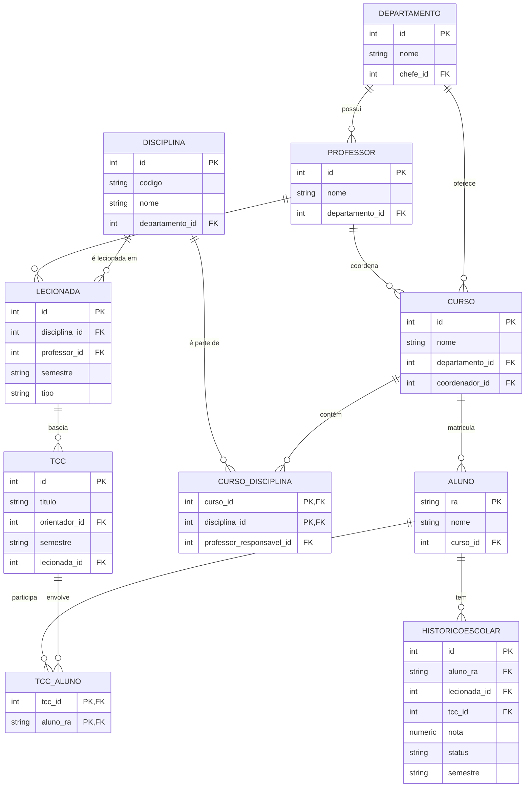

# Projeto Banco de Dados para Universidade

Este projeto implementa um sistema de banco de dados para uma universidade. O sistema armazena e gerencia informações sobre alunos, professores, departamentos, cursos, disciplinas, históricos escolares, histórico de disciplinas lecionadas por professores e TCCs.

## Sumário

- [Descrição](#descrição)
- [Modelos](#modelos)
  - [Modelo Entidade-Relacionamento (MER)](#modelo-entidade-relacionamento-mer)
  - [Modelo Relacional na 3FN](#modelo-relacional-na-3fn)
- [Estrutura do Projeto](#estrutura-do-projeto)
- [Como Executar](#como-executar)
- [Queries SQL](#queries-sql)
- [Equipe](#equipe)
- [Observações](#observações)

## Descrição

O sistema foi desenvolvido para simular o funcionamento de um banco de dados universitário. Ele possibilita:

- Criação de alunos com registros (RAs) únicos.
- Geração automática de históricos escolares para os alunos, levando em conta reprovações e repetições de disciplinas, e tratamento específico para a realização do TCC.
- Execução de diversas queries SQL para validar a consistência dos dados e obter informações relevantes, como:
  - Histórico escolar completo de um aluno (incluindo reprovações e aprovações nas iterações seguintes).
  - Lista de TCCs orientados por um professor, com os respectivos alunos.
  - Matriz curricular de cursos e outras estatísticas dos registros.

## Modelos

### Modelo Entidade-Relacionamento (MER)

Exemplo com Mermaid:


### Modelo Relacional na 3FN

Os modelos relacionais seguem as definições apresentadas no arquivo [tabelas_SQL.txt](tabelas_SQL.txt), garantindo que todas as tabelas estejam na Terceira Forma Normal (3FN) e com as devidas constraints (chaves primárias, estrangeiras, únicas, etc.).

## Estrutura do Projeto

- **BancoDados.py**  
  Código Python responsável por gerar dados fictícios e popular o banco de dados utilizando a API do Supabase.

- **querrys.py**  
  Contém as queries SQL utilizadas para validar e extrair informações do banco, incluindo as queries principais e as extras.

- **tabelas_SQL.txt**  
  Script com a DDL para criação do modelo relacional utilizado no projeto.

- **DescriçãoProjeto.txt**  
  Documento com a descrição do projeto e os requisitos da entrega.

## Como Executar

### Pré-requisitos

- Python 3.8 ou superior
- Conta e API do Supabase configurados

### Instalação das Dependências

No terminal, execute os seguintes comandos para instalar as dependências:

```
pip install supabase
pip install faker
```

### Configuração do Supabase

No arquivo `BancoDados.py`, configure as variáveis `SUPABASE_URL` e `SUPABASE_KEY` com os dados do seu projeto Supabase.

### Criação das Tabelas

1. Acesse o editor SQL do Supabase.
2. Copie o conteúdo do arquivo `tabelas_SQL.txt` e `Dados_iniciais.txt`, execute-os para criar o esquema do banco de dados.

### Execução do Código

Após configurar e criar as tabelas, execute o script para popular o banco de dados:

```
python BancoDados.py
```

### Execução das Queries

As queries SQL estão presentes no arquivo `querrys.py`. Utilize o editor SQL do Supabase para copiá-las e executá-las conforme necessário.

6. **Validação dos Dados:**  
   Utilize os resultados das queries para verificar a consistência e integridade dos dados inseridos.

## Queries SQL

O projeto inclui diversas queries SQL, separadas em:

- **Queries Principais:**  
  - Histórico escolar de um aluno com reprovações e aprovações sucessivas.
  - TCCs orientados por um professor com os nomes dos alunos participantes.
  - Matriz curricular de cursos com disciplinas em comum.
  - Informações sobre disciplinas já cursadas por um aluno, com os nomes dos professores.
  - Lista combinada de chefes de departamento e coordenadores de curso, substituindo campos vazios por "nenhum".

- **Queries Extras:**  
  São 10 queries extras que exploram outros aspectos do banco, como listagem de estudantes, professores, disciplinas específicas, entre outras estatísticas.

Consulte o arquivo `queries.py` para visualizar o código completo de cada query.

## Equipe

- **Pedro H. Satoru Lima Takahashi** – RA: 22.123.019-6   
- **Pedro H. Correia de Oliveira** – RA: XXXXXXX  
- **Paulo Hudson J. da Silva** – RA: XXXXXXX  

*(Substitua pelos nomes e RAs reais dos integrantes.)*

## Observações

- **Requisitos Técnicos:**  
  - Projeto desenvolvido em Python sem o uso de ORM.
  - Banco de dados relacional (utilizando Supabase).
  - As queries SQL foram escritas diretamente para garantir a performance e a integridade dos dados.

- **Execução e Testes:**  
  O código em `BancoDados.py` gera dados fictícios utilizando a biblioteca Faker e executa a inserção dos dados no banco.  
  Caso ocorram erros de inserção ou inconsistência nos dados, verifique as mensagens de erro exibidas no console.

- **Versionamento:**  
  Este projeto utiliza Git para o controle de versão e está hospedado no GitHub.

---

Aproveite o projeto e, caso tenha dúvidas ou encontre problemas, abra uma _issue_ no repositório ou entre em contato com a equipe.
